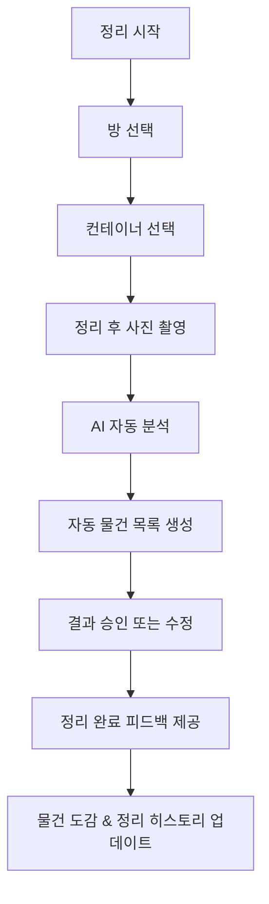

---

사이드프로젝트로 AI 기반 물건 등록 서비스 [홈키퍼](https://doing-something.github.io/homekeeper-showcase/)를 만들었다.  
사진을 업로드하면 AI가 사진 속 물건을 인식하고 자동으로 등록하는 구조다.  
이미지를 업로드한 뒤 분석이 진행되는 동안 방과 컨테이너(서랍장, 옷장 등)를 선택할 수 있다.  
또는 이미지 분석이 끝난 후, 등록된 물품의 상세 화면에서 위치를 설정할 수도 있다.

---

## **1. 문제를 인식했다**

홈키퍼의 출발점은 "물건을 등록하는 것"이 아니라  
"정리를 더 쉽게 하는 것"이었다.  
하지만 현재 플로우는 물건 등록 자체에 초점이 맞춰져 있다.

사진을 찍고 방과 컨테이너를 선택하는 과정은 시간이 걸리고 지루하다.  
집 전체를 정리하려면 이 과정을 계속 반복해야 한다.  
결국 나조차 사용하기 싫어졌다.  
지금 홈키퍼는 유저에게 귀찮은 일을 반복시키는 서비스가 되어 있었다.

서비스가 이대로는 의미가 없다고 판단했다.  
그래서 기존 플로우를 유지하지 않고,  
사용자 경험을 개선하기 위해 UX를 처음부터 다시 설계하기로 했다.

---

## **2. 문제를 다시 정의했다**

서비스의 목적은 물건을 등록하는 것이 아니라 정리 습관을 돕는 것이다.  
단순히 등록 과정을 줄이는 것만으로는 충분하지 않다.  
물건 등록은 목표가 아니라 정리 과정에서 자연스럽게 따라오는 결과가 되어야 한다.

---

## **3. 새로운 목표: “청소 = 등록” 패러다임**

홈키퍼가 제공해야 하는 건 "등록"이라는 작업이 아니라,  
"정리하다 보니 물건이 자동으로 등록되는 경험"이다.

- 사진 촬영은 등록하기 위해가 아니라 정리 완료를 기록하기 위해
- 물건 등록은 목표가 아니라 결과물
- 사용자가 느껴야 하는 건 “등록했다”가 아니라 “정리했다”라는 성취감

---

## **4. 경험을 바꾸는 UX 설계**

이번 개선의 핵심은 서비스 경험을 바꾸는 것이다.  
데이터 구조는 그대로 두되, 사용자가 서비스를 통해 느끼는 흐름을 전환한다.

- 사진 촬영 목적 전환  
  지금은 사진을 "등록하기 위해" 찍지만,  
  앞으로는 "정리한 상태를 기록하기 위해" 찍는 경험으로 바꿀 계획이다.  
  등록은 사용자가 의식하지 않아도 자동으로 처리되도록 설계한다.

- 작은 단위 정리 경험  
  방 전체가 아니라 서랍, 상자, 책꽂이 같은 작은 컨테이너 단위로 정리하는 흐름을 설계한다.  
  한 번에 완벽하게 등록해야 한다는 부담을 줄인다.

- 정리 세션 개념 도입  
  한 컨테이너를 정리할 때마다 하나의 세션으로 기록하고,  
  세션 단위로 성취감을 제공한다.

- 시각적 피드백 제공  
  자동 등록된 물건을 물건 도감처럼 시각화하고,  
  컨테이너별 정리 히스토리를 제공해  
  정리 과정을 보상감 있는 경험으로 만든다.

---

## **5. 개선 후 UX 플로우**

---

**English Summary:** Redesigning Homekeeper, an AI-based item registration service, to focus on the organizing experience rather than just item registration. The key insight is shifting from "registration as a goal" to "registration as a natural result of organizing", creating a more intuitive and rewarding user experience.
